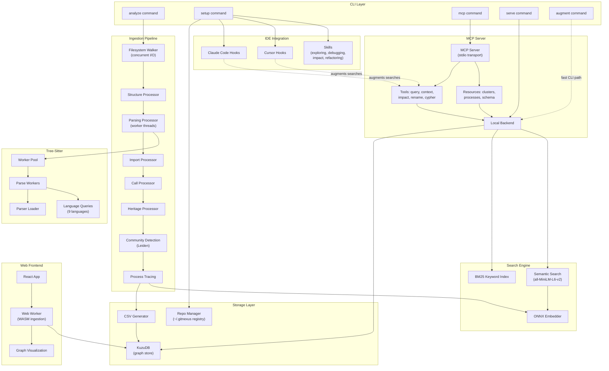

# GitNexus Architecture

> Auto-generated from the GitNexus knowledge graph (1021 symbols, 2552 edges, 79 execution flows).

## Overview

GitNexus is a graph-powered code intelligence platform that indexes codebases into a knowledge graph and exposes them via MCP (Model Context Protocol) tools for AI agents. It consists of three packages:

- **`gitnexus/`** — Core CLI + MCP server (published to npm). Indexes repositories, stores graphs in KuzuDB, and serves queries.
- **`gitnexus-web/`** — Browser-based frontend with WebAssembly tree-sitter and in-browser KuzuDB.
- **`gitnexus-claude-plugin/`** / **`gitnexus-cursor-integration/`** — IDE integrations that augment AI agent tool calls with graph context.

## Functional Areas

The codebase is organized into 14 functional clusters detected by community analysis:

| Module | Symbols | Cohesion | Responsibility |
|--------|---------|----------|----------------|
| **Ingestion** | 108 | 24% | Multi-phase pipeline: file walking, tree-sitter parsing, import resolution, call tracing, heritage extraction, community detection, process tracing |
| **Kuzu** | 50 | 23% | KuzuDB graph storage adapter, CSV generation, schema management, query execution |
| **Embeddings** | 46 | 35% | Embedding pipeline: text generation from symbols, ONNX model inference, vector storage |
| **Components** | 41 | 35% | Web UI React components (graph visualization, search, navigation) |
| **Local** | 38 | 15% | MCP backend: tool implementations (query, context, impact, rename), resource handlers, search (BM25 + semantic) |
| **Workers** | 38 | 27% | Web Workers for browser-side ingestion and tree-sitter parsing; Node.js worker threads for parallel parsing |
| **LLM** | 28 | 37% | LLM-based cluster enrichment, prompt building, provider abstraction |
| **CLI** | 24 | 35% | Command handlers (analyze, setup, serve, mcp), AI context file generation, IDE hook/skill installation |
| **Storage** | 22 | 32% | Repository registry, `.gitnexus/` directory management, staleness detection |
| **Services** | 14 | 31% | Shared services (config, ignore patterns, language support) |
| **Hooks** | 12 | 56% | Claude Code / Cursor hook scripts for augmenting search tools with graph context |
| **Search** | 11 | 36% | Hybrid search: BM25 keyword index + semantic vector search with reciprocal rank fusion |

## Key Execution Flows

### 1. CLI Analyze Pipeline

The primary ingestion path when a user runs `npx gitnexus analyze`:

```
analyzeCommand (cli/analyze.ts)
  → runPipelineFromRepo (ingestion/pipeline.ts)
    → walkRepository          — concurrent file I/O (32 parallel reads)
    → processStructure        — folder/file graph nodes
    → processParsing          — tree-sitter AST parsing (worker threads)
    → processImports          — import/require/use resolution
    → processCalls            — function call tracing with confidence
    → processHeritage         — extends/implements relationships
    → processCommunities      — Leiden community detection
    → processProcesses        — execution flow tracing
  → loadGraphToKuzu           — CSV export → KuzuDB bulk import
  → runEmbeddingPipeline      — generate + store symbol embeddings
  → generateAIContextFiles    — write CLAUDE.md, AGENTS.md, skills
```

### 2. MCP Server Request Flow

When an AI agent calls a GitNexus MCP tool:

```
mcpCommand (cli/mcp.ts)
  → startMCPServer (mcp/server.ts)
    → callTool (mcp/local/local-backend.ts)
      → ensureInitialized     — lazy KuzuDB connection + embedder init
      → query/context/impact  — graph traversal via KuzuDB Cypher
      → semanticSearch        — ONNX embedding + vector similarity
    → readResource (mcp/resources.ts)
      → queryClusters/queryProcesses — direct graph queries
```

### 3. Graph Storage Pipeline

```
loadGraphToKuzu (kuzu/kuzu-adapter.ts)
  → generateAllCSVs (kuzu/csv-generator.ts)
    → generateFileCSV         — node CSVs per label type
    → escapeCSVField          — UTF-8 sanitization
  → KuzuDB COPY FROM          — bulk CSV import
  → createIndexes             — property indexes for query performance
```

### 4. Embedding Pipeline

```
runEmbeddingPipeline (embeddings/embedding-pipeline.ts)
  → generateBatchEmbeddingTexts (embeddings/text-generator.ts)
    → generateEmbeddingText   — symbol → natural language description
    → generateFunctionText    — include signature, calls, file context
    → cleanContent            — strip noise, truncate
  → embedBatch                — ONNX Runtime inference (all-MiniLM-L6-v2)
  → storeEmbeddings           — KuzuDB vector storage
```

### 5. Web App Pipeline (Browser)

```
AppStateProvider (hooks/useAppState.tsx)
  → runPipeline (workers/ingestion.worker.ts)   — Web Worker
    → runPipelineFromFiles (ingestion/pipeline.ts)
      → createKnowledgeGraph
      → processParsing        — WASM tree-sitter
      → processImports/Calls/Heritage
      → processCommunities/Processes
  → loadGraphToKuzu           — in-browser KuzuDB (WASM)
```

## Architecture Diagram



## Data Flow Summary

```
Source Code
    │
    ▼
┌─────────────────────────────────────────┐
│  Ingestion Pipeline (8 phases)          │
│  Files → AST → Symbols → Relationships │
│  → Communities → Execution Flows        │
└─────────────────┬───────────────────────┘
                  │
          ┌───────┴───────┐
          ▼               ▼
    ┌──────────┐   ┌────────────┐
    │  KuzuDB  │   │ Embeddings │
    │  (graph) │   │ (vectors)  │
    └────┬─────┘   └─────┬──────┘
         │               │
         └───────┬───────┘
                 ▼
         ┌──────────────┐
         │  MCP Server  │
         │  (7 tools)   │
         └──────┬───────┘
                │
    ┌───────────┼───────────┐
    ▼           ▼           ▼
 Claude      Cursor      Other
  Code      Editor     MCP Clients
```

## Supported Languages

Tree-sitter grammars are included for: **TypeScript**, **JavaScript**, **Python**, **Java**, **C**, **C++**, **C#**, **Go**, **Rust**.

## Key Design Decisions

1. **Augmentation over replacement** — Hooks enrich existing AI agent tools (Grep, Glob, Bash) with graph context rather than replacing them
2. **Native tree-sitter** — Uses N-API bindings (not WASM) in the CLI for performance; WASM in the browser
3. **Worker thread parsing** — CPU-bound tree-sitter parsing parallelized across `cpus - 1` worker threads
4. **Hybrid search** — BM25 keyword + semantic vector search combined with Reciprocal Rank Fusion for ranking
5. **LRU AST cache** — Parsed trees are cached across pipeline phases to avoid redundant re-parsing
6. **Deterministic IDs** — `generateId(label, qualifiedName)` ensures idempotent graph construction

---

## North Star: Closed-Loop Full-Stack Graphs (TypeScript + Laravel PHP + Blade + Svelte)

> Note: This section is a hand-maintained addendum (not auto-generated).

**Goal:** extend GitNexus so agents can trace *end-to-end* “vectors” (entry points → controllers → services/jobs/events → views/templates → JS/Svelte) with reliable blast radius — without falling back to grep-driven archaeology.

### Success Criteria (what “effective” means)

- **PHP is symbol-indexed**: `.php` files produce `Class` / `Method` / `Function` nodes plus `DEFINES`/`MEMBER_OF` edges (call-graph + blast radius works).
- **Laravel is framework-aware**: high-confidence edges connect `routes/*` → `Controller@method` and other “wiring” constructs (events, scheduler, view rendering).
- **Cross-stack HTTP is deterministic (monorepo-optimized)**: TS/TSX HTTP calls (fetch/Axios) connect directly to the exact Laravel controller `Method` via explicit `CALLS` edges with `reason` starting `http-...` (not `fuzzy-global`).
- **Templates participate in the graph**: Blade and Svelte are not “dead ends”; they are at least connected as `Template`/`File` nodes with meaningful relationships.
- **Confidence-first invariant**: prefer skipping uncertain dynamic edges over injecting noisy guesses (keeps `impact` and `processes` useful).

> Scope note (monorepo-optimized): for cross-stack tracing, we optimize for **one-hop deterministic** “HTTP request → route → controller method” edges, rather than a single continuous call chain across languages.

### Implementation Plan (staged, plug’n’play with current pipeline)

### Canonical Build Order (so we don’t “jump”)

The milestones below are written as capability buckets, but the **development order** should be treated as:

1) **M0 → M1 (PHP plumbing + symbols)** — get deterministic `Class`/`Method`/`Function` nodes and `DEFINES` edges.
   - Gate: the PHP fixture tests stay green (`gitnexus/test/php-language.test.js`).

2) **M2 (imports) — harden before anything edge-y**
   - Start with `use` → `IMPORTS` (done), then harden:
     - Composer PSR-4 mappings (root + package-level `composer.json`)
     - `use Foo\\Bar as Baz` alias handling
     - grouped imports: `use Foo\\{Bar,Baz};`
   - Gate: high-resolution import tests that cover `App\\…` and at least one non-`App\\…` namespace.

3) **M4 (Laravel wiring) — routes first**
   - Add explicit runtime edges like `routes/*` → `Controller@method` with **high confidence + clear reason strings**.
   - This depends on M1 (symbols exist) and M2 (class/file resolution works).
   - Gate: tests proving `Route::get(..., [C::class,'m'])` and `'C@m'` map to the correct `Method` node.

4) **M3 (PHP call edges) — high-confidence only**
   - Add PHP `CALLS` extraction + conservative resolution tiers (same-file / import-resolved first).
   - This depends heavily on M2 (import resolution), otherwise everything becomes fuzzy/noisy.
   - Gate: tests that `$this->foo()` resolves in-class and that `new TicketService(); $x->handle()` resolves when `$x` type is obvious.

5) **M5 (Blade templates)**
   - Create template-to-template edges first (`@extends`, `@include`, components), then connect PHP “renders” to templates.
   - Gate: blade nodes participate in graph (not dead ends) and edges exist between templates.

6) **M6 (Svelte awareness)**
   - Minimum viable: `.svelte` files become valid `IMPORTS` targets from TS/JS.
   - Gate: TS/JS imports to `.svelte` resolve to the correct file.

7) **M7 (acceptance on real monorepos)**
   - Re-run the Cypher acceptance queries on the target repo(s) and ensure the counts/edges move in the expected direction.

If you hit a milestone and it’s forcing you into “stringly guesswork”, that’s a signal to go **back to M2** and harden resolution rather than pushing forward with low-confidence edges.

Milestone 0 — **Enable PHP parsing (plumbing)**
- Add `PHP` to `SupportedLanguages` and `getLanguageFromFilename`, but **exclude** `*.blade.php` from PHP parsing.
- Add `tree-sitter-php` to parser loaders (CLI + worker) and register `PHP_QUERIES`.
- Target files: `gitnexus/src/config/supported-languages.ts`, `gitnexus/src/core/ingestion/utils.ts`, `gitnexus/src/core/tree-sitter/parser-loader.ts`, `gitnexus/src/core/ingestion/workers/parse-worker.ts`, `gitnexus/src/core/ingestion/tree-sitter-queries.ts`.

Milestone 1 — **PHP symbol extraction**
- Queries to extract: namespaces, `class`/`interface`/`trait`, methods, functions (and `extends`/`implements` heritage).
- Emit nodes with deterministic IDs and connect via `DEFINES` + `MEMBER_OF` like other languages.
- Ensure exports semantics are coherent for PHP (public classes/functions treated as exported by default; internal helpers can remain non-exported).

Milestone 2 — **PHP import resolution (Composer + `use`)**
- Build a PHP import resolver that understands:
  - `namespace ...;` + `use Foo\\Bar as Baz;`
  - Composer PSR-4 mappings from `composer.json` (repo-root and package-level where relevant)
- Create `IMPORTS` edges from symbol usage to resolved files/symbols with strong `reason` strings (e.g. `composer-psr4`, `php-use-alias`).

Milestone 3 — **PHP call edges (high-confidence only)**
- Extract and resolve:
  - function calls `foo()`
  - static calls `Foo::bar()`
  - method calls `$obj->bar()` when `$obj` type is resolvable (same-file / constructor assignment / obvious container resolution)
- Reuse existing confidence scoring tiers (`import-resolved`, `same-file`, `fuzzy-global`) and keep fuzzy-global conservative.

Milestone 4 — **Laravel-aware “wiring” edges (routes, events, schedule, views)**
- Add a framework pass that produces *explicit* runtime edges as `CALLS` with high confidence + clear `reason`:
  - **Routes**: `Route::get('/x', [C::class,'m'])` and `'C@m'` → `C::m`
  - **Events**: subscriber `$subscribe` and listeners `$listen` → handler methods
  - **Scheduler**: `$schedule->job(Foo::class)` / `->command(...)` → job/command handlers
  - **Views/Mail**: `view('a.b')`, `Mail::to(...)->send(new Mailable)` → blade template(s)
  - **HTTP (TS/TSX) → Laravel routes (monorepo)**:
    - Frontend extraction must handle dashboard conventions:
      - Axios instances named `Axios` (not just `axios`) and member calls like `Axios.get(...)`.
      - Template-literal URLs with params (`/x/${id}/y`) by converting interpolations into wildcards (e.g. `/x/*/y`) for conservative matching.
      - Base URL prefixes like `Axios.defaults.baseURL = \`${apiUrl}/api\`` so relative request paths are matched under `/api/...` by default.
    - Backend route indexing must match runtime prefixes + resource expansion:
      - Apply correct route file prefixes (e.g. `routes/dashboard.php` under `/api`, `routes/mobile.php` under `/api-mobile`) as defined in `RouteServiceProvider`.
      - Apply in-file group prefixes (`Route::prefix(...)->group(...)`, `Route::group(['prefix' => ...], ...)`) so relative URIs index correctly.
      - Expand `Route::apiResource(...)` into concrete verb+path patterns (index/store/show/update/destroy) so HTTP matching can succeed.
    - Confidence policy:
      - Exact string match: `confidence >= 0.95`
      - Wildcard match (templated/param): `confidence >= 0.90`
      - Anything ambiguous (multiple matches): skip
- Keep this as an additive pass after `calls` (so communities/processes benefit) without changing core edge shapes.

Milestone 5 — **Blade templates as first-class `Template` nodes**
- Treat `resources/views/**/*.blade.php` as `Template` nodes (not PHP AST).
- Connect template relationships using existing edge types:
  - `@extends`, `@include`, `@component`, `<x-*>` → `IMPORTS`/`EXTENDS`-shaped edges between templates.
- Fix Kuzu persistence gaps so `Template` nodes actually land in CSV/COPY (schema + CSV generation alignment).

Milestone 6 — **Svelte awareness (minimal, useful, non-invasive)**
- Minimum viable: `.svelte` files are linkable targets of `IMPORTS` from TS/JS.
- Stretch: extract `<script>` blocks and run existing TS/JS parsing on that content (symbols + calls) while keeping the owning filePath as the `.svelte` file.

Milestone 7 — **TDD + acceptance verification**
- Add fixture repos under `gitnexus-test-setup/` (tiny Laravel-ish app + blade + svelte + TS client).
- Tests assert:
  - `.php` produces nonzero `Class`/`Method` nodes
  - `routes` → `Controller` edges exist with expected confidence/reason
  - blade `Template` nodes are present and connected
- Add “real world” acceptance queries (Kuzu Cypher) to validate on large monorepos.

### Nexus-Driven Workflow (use GitNexus to extend GitNexus)

- Use `query` to find the real “change point” symbols (e.g. “supported languages”, “parse worker”, “tree-sitter queries”, “kuzu csv generator”).
- Use `context` on the chosen symbols to enumerate upstream/downstream dependencies before editing.
- Use `impact` on core ingestion functions (pipeline + processors) to turn the blast radius into a checklist (callsites + tests to run).
- Use `cypher` acceptance queries (below) after re-indexing to verify the graph shape changed as intended.

### Roadmap Item Alignment

- **Incremental indexing** helps iteration speed once PHP is supported, but it isn’t required to ship PHP symbol indexing.
- **AST decorator detection** isn’t needed for PHP baseline; it may become relevant later for PHP 8 attributes / annotations.
- **LLM cluster enrichment** is optional; PHP support should work without it.

### Acceptance Queries (Kuzu Cypher)

These are the “does it work?” sanity checks for PHP + Laravel monorepos:

```cypher
MATCH (f:File) WHERE f.filePath ENDS WITH '.php' RETURN count(f);
MATCH (c:Class) WHERE c.filePath ENDS WITH '.php' RETURN count(c);
MATCH (m:Method) WHERE m.filePath ENDS WITH '.php' RETURN count(m);
MATCH (f:File)-[:CodeRelation {type:'DEFINES'}]->(n) WHERE f.filePath ENDS WITH '.php' RETURN count(n);
```

Laravel wiring should show nonzero route/controller and scheduler/event edges once implemented:

```cypher
MATCH (a)-[:CodeRelation {type:'CALLS'}]->(b)
WHERE a.filePath CONTAINS 'routes/' AND b.filePath CONTAINS 'app/Http/Controllers/'
RETURN count(*);
```

Cross-stack HTTP wiring (dashboard → backend) should show nonzero explicit edges (not `fuzzy-global`):

```cypher
MATCH (a)-[r:CodeRelation {type:'CALLS'}]->(b)
WHERE a.filePath STARTS WITH 'apps/dashboard/' AND r.reason STARTS WITH 'http-'
RETURN count(*);
```

For “trustworthy one-hop”, require high-confidence edges into backend PHP handlers:

```cypher
MATCH (a)-[r:CodeRelation {type:'CALLS'}]->(b)
WHERE a.filePath STARTS WITH 'apps/dashboard/'
  AND b.filePath STARTS WITH 'apps/backend/'
  AND r.reason STARTS WITH 'http-'
  AND r.confidence >= 0.9
RETURN count(*);
```
