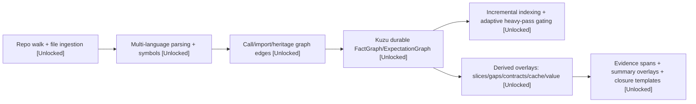
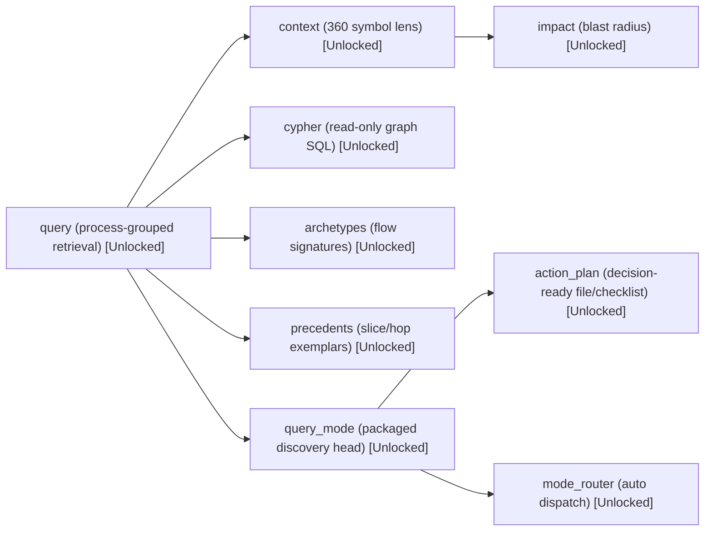
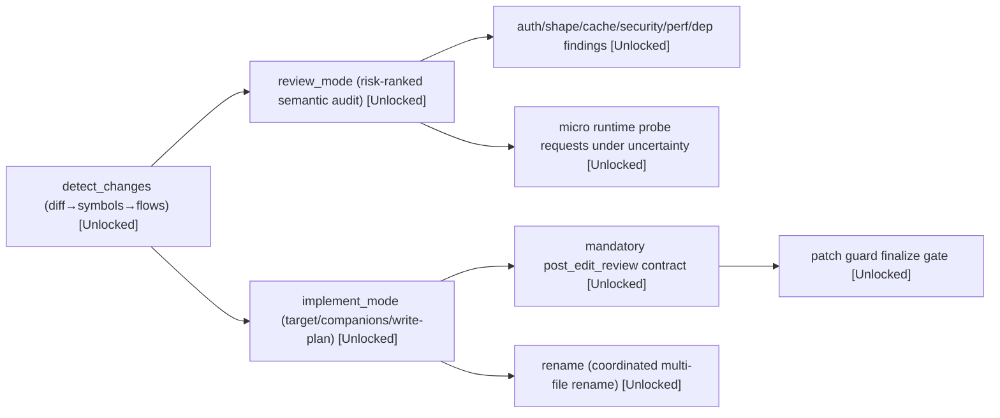
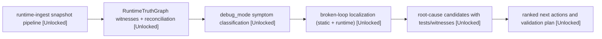
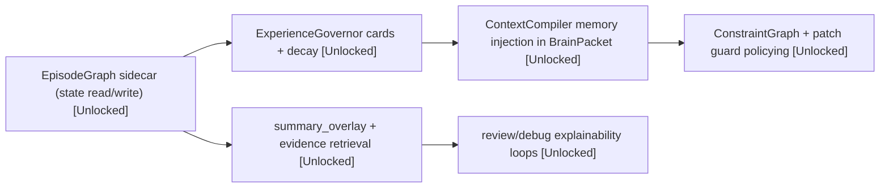
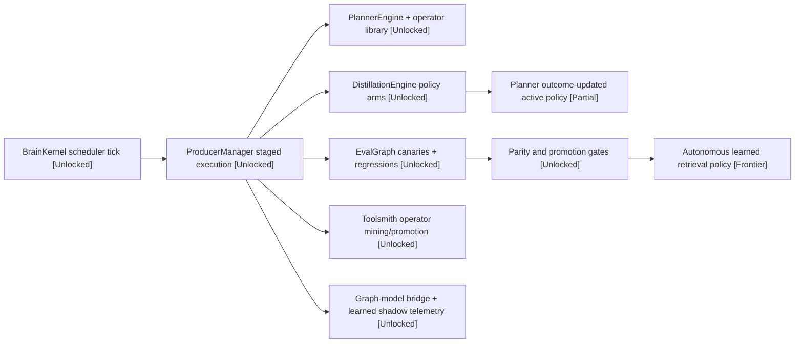

# Project Ascension Tech Trees

This document presents the current GitNexus capability surface as Civ-style research trees with game-card breakdowns.

Legend:

* `[Unlocked]` = implemented and in active surface area
* `[Partial]` = implemented but not fully promoted/calibrated in latest parity state
* `[Frontier]` = designed path, not a stable default yet

How to read each tree:

* `Theme` = what strategic advantage the tree gives the agent
* `Mechanics` = how the internals actually produce the capability
* `Unlocks now` = current practical effects for users/agents
* `Future research` = next likely V3+ branches with prerequisites

Current snapshot:

* Indexed repo shape: `351 files`, `3310 symbols`, `269 processes`
* Public MCP/kernel surface includes: `query`, `context`, `impact`, `cypher`, `archetypes`, `precedents`, `query_mode`, `review_mode`, `implement_mode`, `debug_mode`, `mode_router`, `detect_changes`, `rename`, `episode_state/update`, `evidence_spans`, `summary_overlay`, `closure_templates`
* Latest local parity gate at the time of this catalog: `met=17`, `partial=2`, `missing=0`, `unverified=0`
* Current partial unlocks: `query-adaptive-operator-selection`, `feedback-planner-updates-from-outcomes`

## 1. Founding Era: Index Civilization

**Theme:** Found a durable, queryable civilization of code truth.

**Mechanics:**

1. File discovery and parser passes materialize symbols/relations.
2. Durable graph storage persists fact and expectation layers.
3. Derived overlays convert raw graph data into proof-carrying artifacts.

**Unlocks now:**

* Stable incremental index updates instead of full rebuild dependency.
* Proof anchors (`evidence_spans`, summaries, closure templates) for downstream skills.

**Future research (V3+):**

1. Parser confidence scoring per language edge family (requires edge provenance expansion).
2. Adaptive parser routing by repo topology (requires historical parse-cost model).
3. Distributed ingestion shards for very large monorepos (requires multi-writer orchestration).

## 2. Classical Era: Retrieval and Navigation

**Theme:** Turn graph data into navigable strategy maps.

**Mechanics:**

1. Retrieval operators rank candidate processes/symbols/slices.
2. Context and impact tools provide local and blast-radius perspectives.
3. Router and planner wrappers package exploration into repeatable workflows.

**Unlocks now:**

* Rapid architecture discovery with process-first and slice-first views.
* Decision-ready file/check guidance with lower context waste.
* Route-to-mode automation via `mode_router`.

**Future research (V3+):**

1. Full adaptive operator selection by objective type (currently `[Partial]` on parity).
2. Cross-session retrieval policy transfer by repo archetype.
3. Token-budget-aware retrieval auctions across competing operators.

## 3. Medieval Era: Implementation/Review Statecraft

**Theme:** Govern changes before they become regressions.

**Mechanics:**

1. Diff analysis maps changed files to symbols and affected flows.
2. Review mode computes ranked semantic risks with proof and contracts.
3. Implement mode enforces post-edit review and patch-guard gates.

**Unlocks now:**

* Contract-aware review findings (auth/shape/cache/security/perf/dep).
* Mandatory finalize safety checks for implementation paths.
* Coordinated rename support with confidence tagging.

**Future research (V3+):**

1. Auto-generated patch candidates from review findings.
2. Change-intent classification to pick stricter or lighter guardrails.
3. Multi-branch regression forecasting before merge.

## 4. Renaissance Era: Runtime Truth and Debugging

**Theme:** Combine static intelligence with observed runtime reality.

**Mechanics:**

1. Runtime snapshots are ingested and normalized into sidecar truth.
2. RuntimeTruthGraph reconciles static expectations with witness evidence.
3. Debug mode ranks broken-loop candidates and validating actions.

**Unlocks now:**

* Runtime-informed debug ranking instead of static-only suspicion.
* Witness-backed root-cause candidates with test/probe breadcrumbs.
* Selective micro-probe planning when uncertainty is high.

**Future research (V3+):**

1. Always-on low-overhead sampling for hot paths with dynamic throttling.
2. Temporal anomaly signatures for “works then drifts” incidents.
3. Automated replay packs generated from witness traces.

## 5. Industrial Era: Memory/Governance Operations

**Theme:** Institutionalize learning without bloating context.

**Mechanics:**

1. Episode facts are captured in sidecar state.
2. ExperienceGovernor distills and decays memory cards.
3. ContextCompiler injects only high-value cards/objectives into packets.

**Unlocks now:**

* Better continuity across long implementation/debug sessions.
* Governed memory retention with explicit forgetting policies.
* Stronger explainability paths in review/debug outputs.

**Future research (V3+):**

1. Persona-aware memory retrieval profiles (implementer/reviewer/debugger).
2. Auto-pruning based on measured utility decay curves.
3. Memory conflict resolution between static truth and historical heuristics.

## 6. Information Era: Self-Feedback and Ascension Control Plane

**Theme:** Create a self-improving brain with safety-governed promotion.

**Mechanics:**

1. BrainKernel ticks run producer stages and persist manifests.
2. EvalGraph and Distillation score outcomes and policy arms.
3. Promotion/parity gates decide which learned behavior can advance.

**Unlocks now:**

* Single control plane for planner/runtime/memory/eval feedback loops.
* Canary-gated promotion behavior for safer optimization.
* Shadow learned bridge telemetry without autonomous takeover.

**Future research (V3+):**

1. Planner policy auto-promotion to non-baseline default once parity/rollback confidence is sustained (`[Partial]` dependency).
2. Learned operator synthesis with bounded formal safety checks.
3. Closed-loop self-tuning of retrieval/risk thresholds by repo class.

## 7. Quick Operational Read

* The index is no longer just static graph retrieval; it is a multi-stage operating system with planning, runtime reconciliation, memory governance, and promotion gates.
* The strongest unlocked paths are retrieval proofing, review/implement contracts, runtime-aware debug, and non-functional risk surfacing.
* The main remaining promotion frontier is making adaptive planner policy updates fully default from outcome feedback without sacrificing safety gates.
